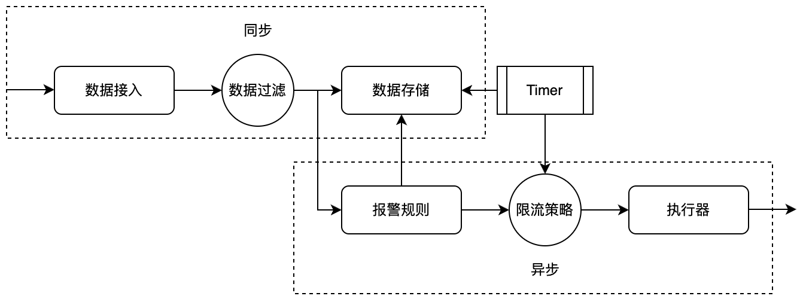

# AlertTool

---

告警工具

---

## 流程


## 结构

### 数据接入

告警工具的入口
```
public class AlertWatcherClient {
    void report(String id);
    void report(String id, String value);
    void report(String id, BigDecimal value);
    void report(String id, Boolean value);
}
```

### 数据过滤

指定过滤规则，只有符合过滤条件的记录才会被记录到数据存储中
```
public abstract class ReportFiltration {
    private ReportFiltration nextFiltration;

    // 返回true即为通过过滤
    public boolean filter(@NonNull Record<?> record){
        // 链式，and逻辑
        if (doFilter(record)){
            return filterNext(record);
        }
        return false;
    }

    // 过滤逻辑
    protected abstract boolean doFilter(@NonNull Record<?> record);

    public boolean filterNext(Record<?> record){
        if (Objects.isNull(nextFiltration)){
            return true;
        }
        return nextFiltration.filter(record);
    }
}
```

### 数据存储

并发，有序存储报警记录
```
public interface RecordBase {

    boolean append(Record<?> record);
    boolean append(Record<?> record, int retryTimes);
    boolean clean(String id, long endTimeStamp);

    Collection<Record<?>> query(String indicator, long startTimeStamp, long endTimeStamp);
    Collection<Record<?>> query(String indicator, long startTimeStamp, long endTimeStamp, OperationCondition<?> condition);
}
```

### 报警规则

支持阈值报警，时间范围次数报警
```
public interface AlertRule {
    boolean isEffective(Record<?> record);
}
```

### 报警限流

支持立即报警，时间窗口报警，带有沉默时长的报警
```
public interface AlertLimiter {
    boolean limit(Record<?> record);
    int getOrder();
}
```

### 执行器

报警的具体执行器
支持飞书群机器人
```
public interface AlertExecutor {
    void execute(String value);
}
```

## 使用示例

### 快速开始

```
public class Main {
    public static void main(String... args){
        // 构建
        AlertWatcherBuilder alertWatcherBuilder = AlertWatcherBuilder.newAlertWatcherBuilder();
        alertWatcherBuilder.newAlertHandler("指标名", "规则说明", ValueTypeEnum.NONE).
                addLarkAlertExecutor("https://open.feishu.cn/open-apis/bot/v2/hook/64d374d5-xxxx-xxxx-xxxx-a890d9c3d389");
        AlertWatcherClient alertWatcherClient = alertWatcherBuilder.build();
        
        // 触发
        alertWatcherClient.report("指标名");
    }
}
```

### 设置报警规则(单次仅能设置一条规则)

```
public class Main {
    public static void main(String... args){
        AlertWatcherBuilder alertWatcherBuilder = AlertWatcherBuilder.newAlertWatcherBuilder();
        alertWatcherBuilder.newAlertHandler("指标名", "规则说明", ValueTypeEnum.NONE).
                addLarkAlertExecutor("https://open.feishu.cn/open-apis/bot/v2/hook/64d374d5-xxxx-xxxx-xxxx-a890d9c3d389").
                // 立即报警，缺省策略
                setImmediateAlertRule();
                // 范围报警，等于20，支持 > < = >= <=
                setOperatorAlertRule(OperatorEnum.EQUAL, 20);
                // 时间次数报警，10秒钟内3次触发，此时报警值为触发次数
                setTimeRangeAlertRule(10, 3);
                // 时间次数范围混合报警，值等于20，且10秒钟内3次触发
                setOperatorAndTimeRangeAlertRule(OperatorEnum.EQUAL, 20, 10, 3);
        AlertWatcherClient alertWatcherClient = alertWatcherBuilder.build();
    }
}
```

### 设置限流策略(可同时设置多策略，AND关系)
```
public class Main {
    public static void main(String... args){
        AlertWatcherBuilder alertWatcherBuilder = AlertWatcherBuilder.newAlertWatcherBuilder();
        alertWatcherBuilder.newAlertHandler("指标名", "规则说明", ValueTypeEnum.NONE).
                addLarkAlertExecutor("https://open.feishu.cn/open-apis/bot/v2/hook/64d374d5-xxxx-xxxx-xxxx-a890d9c3d389").
                // 不限流，缺省策略
                addImmediateAlertLimiter();
                // 时间窗口限流，将3秒内的所有报警合并为一条报警消息，此时报警值为触发次数
                addTimeWindowAlertLimiter(3)
                // 死区报警，前一次触发后的3秒内不会再次触发报警
                addDeadZoneAlertLimiter(3);
        AlertWatcherClient alertWatcherClient = alertWatcherBuilder.build();
    }
}
```

### 设置执行器(目前仅支持Lark群机器人)

需要替换群机器人的webhook，详情参见 自定义飞书机器人 
```
public class Main {
    public static void main(String... args){
        AlertWatcherBuilder alertWatcherBuilder = AlertWatcherBuilder.newAlertWatcherBuilder();
        alertWatcherBuilder.newAlertHandler("指标名", "规则说明", ValueTypeEnum.NONE).
                // 添加Lark群机器人，传入webhook
                addLarkAlertExecutor("https://open.feishu.cn/open-apis/bot/v2/hook/64d374d5-xxxx-xxxx-xxxx-a890d9c3d389");
        AlertWatcherClient alertWatcherClient = alertWatcherBuilder.build();
    }
}
```

### 设置多条规则

* 支持在同一个指标下创建多条报警规则
* 支持创建不同指标的报警规则
```
public class Test {
    public static void main(String... args){
        AlertWatcherBuilder alertWatcherBuilder = AlertWatcherBuilder.newAlertWatcherBuilder();
        
        alertWatcherBuilder.newAlertHandler("指标1", "指标1-规则1", ValueTypeEnum.NUMBER).
                setOperatorAlertRule(OperatorEnum.EQUAL, 20).
                addLarkAlertExecutor("https://open.feishu.cn/open-apis/bot/v2/hook/64d374d5-xxxx-xxxx-xxxx-a890d9c3d389");
        
        alertWatcherBuilder.newAlertHandler("指标1", "指标1-规则2", ValueTypeEnum.NUMBER).
                setOperatorAlertRule(OperatorEnum.EQUAL, 12).
                addLarkAlertExecutor("https://open.feishu.cn/open-apis/bot/v2/hook/64d374d5-xxxx-xxxx-xxxx-a890d9c3d389");
        
        alertWatcherBuilder.newAlertHandler("指标2", "指标2-规则1", ValueTypeEnum.NONE).
                addLarkAlertExecutor("https://open.feishu.cn/open-apis/bot/v2/hook/64d374d5-xxxx-xxxx-xxxx-a890d9c3d389");
        
        AlertWatcherClient alertWatcherClient = alertWatcherBuilder.build();

        alertWatcherClient.report("指标1", new BigDecimal(20));
        alertWatcherClient.report("指标1", new BigDecimal(12));
        alertWatcherClient.report("指标2");
    }
}
```

### 绑定报警值类型与report方法

* ValueTypeEnum.NONE：report(String)
* ValueTypeEnum.BOOLEAN：report(String, boolean)
* ValueTypeEnum.NUMBER：report(String, BigDecimal)
* ValueTypeEnum.String：report(String, String)

## 注意事项

1. 默认实现中，·基于 ConcurrentSkipListMap 实现报警记录的存储，默认存储 2*max(120, 报警时间范围(秒)) 的数据，之后会被清理掉。当时间范围极端长，或报警记录极端多的情况下，可能会大量占用内存。
